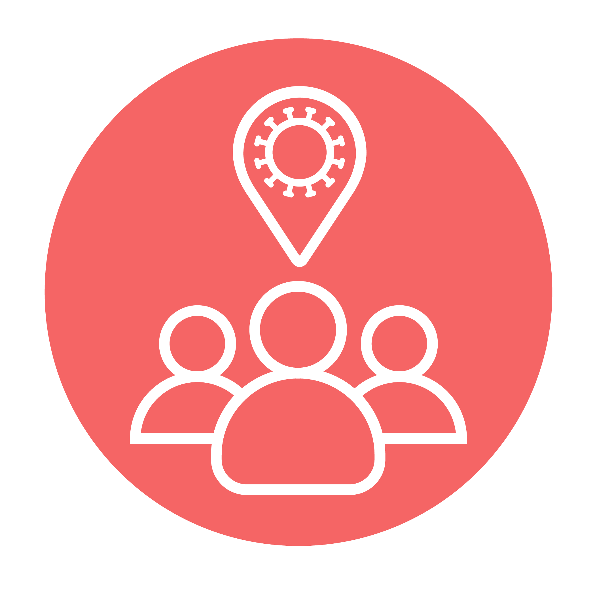

<!-- Tried to include all things of a basic readme.md -->
# The-Mass-Tracker

<p align="center">
  
 </p>

```sh 
Tracks Crowd status thus helping in socializing while maintaining social distance amidst the current pandemic. 
```

> This project was our first attempt towards [MLH HackJaipur Hackathon](https://www.hackjaipur.com/) and my team comprised of [Suhit Agarwal](https://www.github.com/SuhitAgarwal) and [Ayush Goyal](https://github.com/aiqqia).

### Contents

* [About](#about)
* [Our Journey and Problems - First virtual Hackathon as amateurs](#our-journey-and-problems---first-virtual-hackathon-as-amateurs)
* [Video Explanation](https://www.youtube.com/watch?v=LB54oAnuQyE&feature=youtu.be)
* [Built Using](#built-using)
* [Acknowledgements](#acknowledgements)

---

## About


During these testing times of the coronavirus pandemic, we all prefer to stay home as much as possible. But, sometimes we have to get some essentials for our family and loved ones. Sometimes we need to get out of our houses and go for a walk. We need to meet friends and go for work. Crowded markets and malls are more prone to spreading the virus and everyone is worried about it. Well, worry no more! We bring to you The Mass Tracker where you can view the crowd status of places around you in real time and decide for yourself which is safest place for you to travel.

_https://masstracker.tech/_

## Our Journey and Problems - First virtual Hackathon as amateurs


The project we have built together was a rollercoaster ride. After we got the team together, we brainstormed an idea. It was very unclear and we had to bring together what each side had to offer. After hours of discussion when we started to build our project it was not easy to decide the framework we were going to make the website in. It was mutually decided that we go with tailwindcss. It turned out to be a good decision. When we finally looked into the details, there was a lot of confusion as to how we were going to take credible data input from users and create a backend for the website in such a short time. We decided to embed forms into our website eventually so that we can take all required data and structure it to our benfit.

We then faced a problem with how we were to create a user friendly viewing system which could entice the viewers and attaract more. We went with a google map api and it took hours of coding and research to apply it to our website. We finally created pin locations so as to provide a narrower outlook and easy to classify. We decided that as we develop this website we would strengthen the backend and add more credible sources instead of open source. We also created redirecting link to our preview video so as to make it attractive and give a briefing of what was done and how. It was difficult for us to manage time and get it all done in such less time. But eventually everyone's hard work and quick thinking made this possible. We were able to fulfill all requirements and make a functional website to be presented. The idea is very unique and nothing of the sort could be found online so it was very difficult to fetch data. We had to spend an hour to design our own logo and website name. Eventually, it was a long and difficult road, but we reached to a respectable position where we can pitch to you our humble idea which could turn into a much bigger platform which could revoltionise the concept of social distancing.

## Built Using

- **HTML5, Tailwind CSS** : Website styling done with tailwind css.
- **Mapbox GL JS** : API used to show areas on the map.
- **Google Forms** : To collect data since we didn't find any such quick alternative.
- **Firebase** : To store contact form data.
- **Adobe Illustrator** : To design the project logo.

## Acknowledgements

* [Unsplash](https://source.unsplash.com/)
* [Tailblocks](https://mertjf.github.io/tailblocks/)
* [Flaticon](https://www.flaticon.com/)
* [Imgur](https://imgur.com/)
